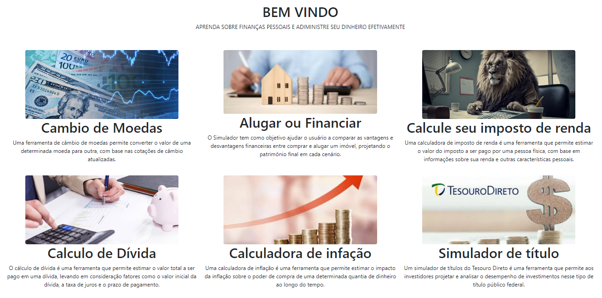
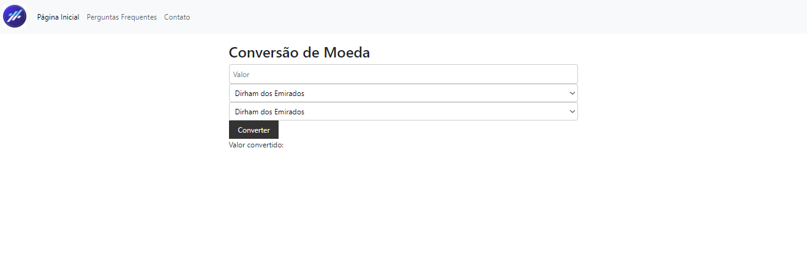
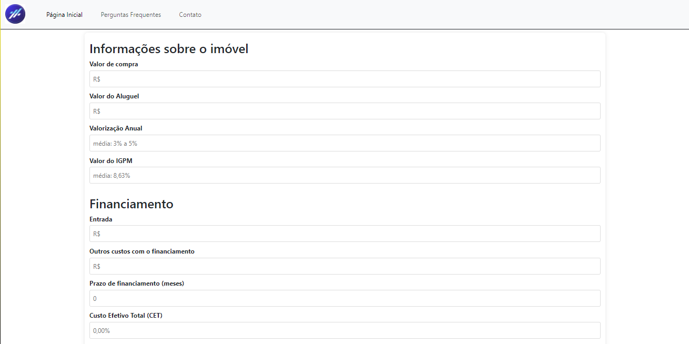
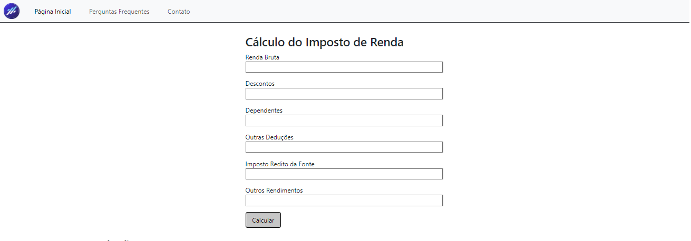
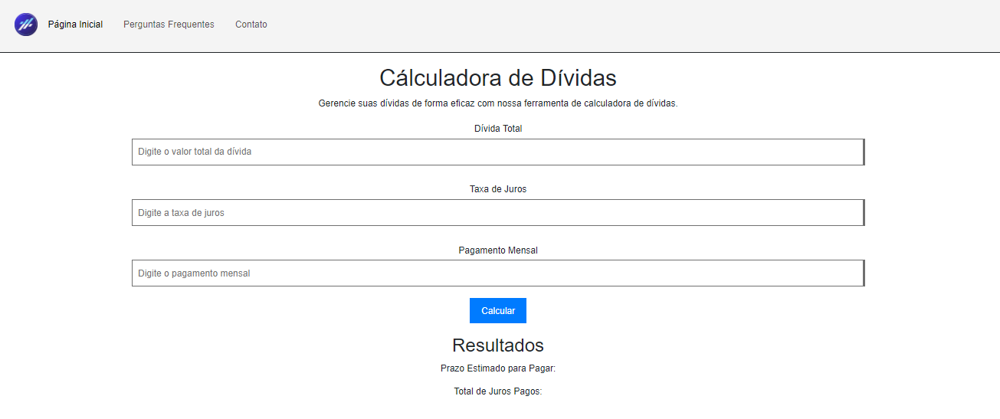
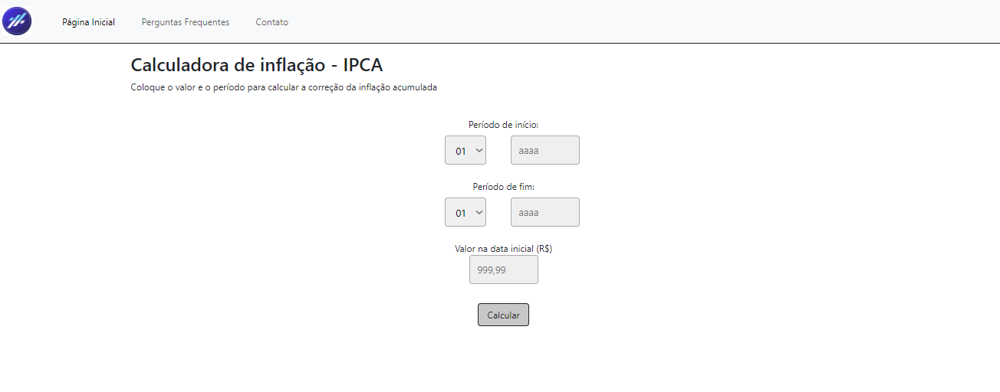
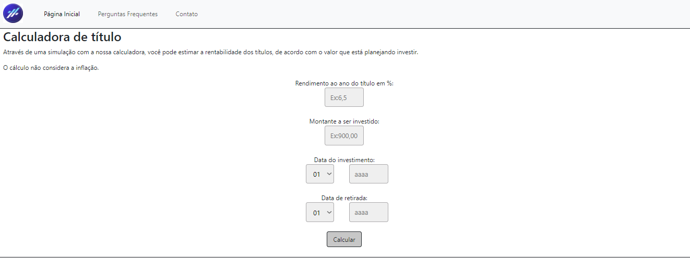

# Informações do Projeto
`TÍTULO DO PROJETO`  

CAPITAL CERTO

`CURSO` 

ANÁLISE E DESENVOLVIMENTO DE SISTEMAS

## Participantes

Arthur Medeiros de Moraes

Eduardo Medeiros de Moraes

Rafael Oliveira Moreira

# Estrutura do Documento

- [Informações do Projeto](#informações-do-projeto)
  - [Participantes](#participantes)
- [Estrutura do Documento](#estrutura-do-documento)
- [Introdução](#introdução)
  - [Problema](#problema)
  - [Objetivos](#objetivos)
  - [Público-Alvo](#público-alvo)
- [Especificações do Projeto](#especificações-do-projeto)
  - [Personas](#personas)
  - [Histórias de Usuários](#histórias-de-usuários)
  - [Requisitos](#requisitos)
- [Projeto da Solução](#projeto-da-solução)
  - [Wireframes](#wireframes)
  - [Mapa de navegação](#mapa-de-navegação)
- [Conclusões](#avaliação-da-aplicação)
  
# Introdução

## Problema

Na busca pela erradicação da pobreza, é essencial abordar um fator-chave: a falta de educação financeira. Este problema contribui significativamente para a perpetuação do ciclo de pobreza em comunidades ao redor do mundo. Sem ferramentas e conhecimentos básicos sobre como administrar finanças pessoais, poupar e investir de forma adequada, indivíduos e famílias enfrentam dificuldades para sair da pobreza e construir um futuro financeiramente estável

## Objetivos

O objetivo geral deste trabalho é desenvolver um software capaz de oferecer soluções educativas para a falta de educação financeira e, consequentemente, contribuir para a erradicação da pobreza. Como objetivos específicos, pretendemos:

1 - Criar uma plataforma interativa e acessível, que disponibilize ferramentas simples para mitigar o ciclo da pobreza.

2 - Desenvolver ferramentas úteis para pessoas que conseguiram superar a pobreza, a fim de continuarem usando a ferramenta.

## Público-Alvo

O público-alvo da aplicação é diversificado e inclui pessoas de todas as faixas etárias e níveis de escolaridade que enfrentam desafios relacionados à falta de educação e gestão financeira. Isso pode abranger desde jovens estudantes em fase de educação básica até adultos que buscam melhorar sua gestão financeira.
 
# Especificações do Projeto

Esta parte do documento apresenta as personas, histórias de usuários e requisitos funcionais para o projeto de software de educação financeira. As personas representam os usuários-alvo do sistema, enquanto as histórias de usuários descrevem cenários de uso específicos. Os requisitos funcionais definem as funcionalidades que o sistema deve oferecer para atender às necessidades dos usuários.

A coleta de dados para a criação das personas e histórias de usuários foi realizada através de entrevistas qualitativas. A ferramenta utilizada para organizar as informações e visualizar as personas foi o Miro.

## Personas

 

## Histórias de Usuários

Com base na análise das personas forma identificadas as seguintes histórias de usuários:

|EU COMO... `PERSONA`| QUERO/PRECISO ... `FUNCIONALIDADE` |PARA ... `MOTIVO/VALOR`                 |
|--------------------|------------------------------------|----------------------------------------|
|Usuário do sistema  | Quero calcular meu imposto de renda anual | Entender melhor minha situação fiscal.|
|Usuário do sistema  | Como usuário internacional, quero converter moedas estrangeiras para minha moeda local | Para realizar transações financeiras com clareza |
|Usuário do sistema  | Como investidor, quero entender como a inflação afeta o valor do meu dinheiro ao longo do tempo.| Para saber o valor do meu dinheiro|
|Usuário do sistema  | Como usuário, quero simular o rendimento de meu título | Para visualizar e ajustar meu investimento |
|Usuário do sistema  | Como usúario, quero simular o valor final do meu patrimônio com e sem a compra do imóvel | Para saber o valor final do meu patrimônio |
|Usuário do sistema  | Como usuário, quero calcular minha dívida | Para saber quanto eu devo |

## Requisitos

A tabela que segue apresenta os requisitos funcionais do projeto. 

### Requisitos Funcionais

|ID    | Descrição do Requisito  | Prioridade |
|------|-----------------------------------------|----|
|RF-001| Permitir que o usuário, faça o cálculo do seu título | MÉDIA | 
|RF-002| Permitir que o usuário, selecione um período de tempo para calcular a inflação acumulada no Brasil nesse período. | MÉDIA |
|RF-003| Permitir que o usuário, faça o cálculo de imposto de renda | MÉDIA |
|RF-004| Permitir que o usuário, veja o valor do câmbio de moedas de diferentes países | MÉDIA |
|RF-005| Permitir que o usuário, simule o valor do patrimonio com e sem a compra de um imóvel | MÉDIA |
|RF-006| Permitir que o usúario, calcule suas dívidas | MEDIA |

### Requisitos Não Funcionais

|ID     | Descrição do Requisito  | Prioridade |
|-------|-----------------------------------------|----|
|RNF-001|Interface fácil de usar para uma navegação sem complicações.| ALTA | 
|RNF-002|A plataforma deve ser acessível para pessoas com diferentes habilidades.| ALTA |
|RNF-003|Tempos de carregamento rápidos e respostas ágeis às interações do usuário.| MÉDIA |
|RNF-004|Funcionamento eficaz em uma variedade de dispositivos e sistemas operacionais.| MÉDIA |

# Projeto da Solução

O desenvolvimento do software de Capital Certo utilizou as seguintes tecnologias e frameworks:

HTML: Linguagem base para estruturação do conteúdo das páginas web.

CSS: Linguagem para estilização da interface gráfica do usuário, garantindo um design responsivo e agradável em diferentes dispositivos.

JavaScript: Linguagem para implementar funcionalidades interativas no site, como calculadoras, gráficos e animações, proporcionando uma experiência dinâmica e engajadora para os usuários.

Bootstrap: Framework para desenvolvimento HTML, CSS e JavaScript.

API: Interface de Programação de Aplicativos (API, do inglês Application Programming Interface) que permite a integração e interoperabilidade entre diferentes sistemas e aplicações.

## Wireframes

## Mapa de navegação

# Conclusões

......  COLOQUE AQUI O SEU TEXTO ......

> Finalize escrevendo um ou dois parágrafos para relembrar o objetivo do projeto, 
> o que foi possível alcançar e o que ficou para um trabalho futuro, e relembrando
> as principais dificuldes encontradas e como foi possível contorná-las. 

O projeto de desenvolvimento do software de Capital Certo abordou de forma ampla a necessidade de oferecer soluções educativas para a falta de educação financeira, que contribui significativamente para a perpetuação do ciclo de pobreza em diversas comunidades. O objetivo geral do projeto é criar uma plataforma interativa e acessível que disponibilize informações claras sobre educação financeira, além de desenvolver ferramentas práticas e recursos de acompanhamento para auxiliar os usuários a aplicar esses conhecimentos em suas vidas.

O público-alvo da aplicação é diversificado, incluindo pessoas de todas as faixas etárias e níveis de escolaridade que enfrentam desafios relacionados à falta de educação financeira, bem como educadores, assistentes sociais e outros profissionais que trabalham diretamente com comunidades em situação de vulnerabilidade socioeconômica.

Para atender às necessidades desse público, o projeto utilizou uma abordagem centrada no usuário, com a coleta de dados por meio de entrevistas qualitativas para a criação de personas e histórias de usuários. Isso resultou em um conjunto de requisitos funcionais e não funcionais que nortearam o desenvolvimento do software.

As tecnologias e frameworks empregados no projeto, como HTML, CSS, JavaScript, Bootstrap e API, permitiram a implementação de uma plataforma interativa, responsiva e integrada, capaz de oferecer recursos educativos, ferramentas de cálculo e simulação, conversão de moedas e outras funcionalidades relevantes para a promoção da educação financeira e, consequentemente, para a erradicação da pobreza.
