# Informações do Projeto
`TÍTULO DO PROJETO`  

CAPITAL CERTO

`CURSO` 

ANÁLISE E DESENVOLVIMENTO DE SISTEMAS

## Participantes

Arthur Medeiros de Moraes

Eduardo Medeiros de Moraes

Rafael Oliveira Moreira

# Estrutura do Documento

- [Informações do Projeto](#informações-do-projeto)
  - [Participantes](#participantes)
- [Estrutura do Documento](#estrutura-do-documento)
- [Introdução](#introdução)
  - [Problema](#problema)
  - [Objetivos](#objetivos)
  - [Público-Alvo](#público-alvo)
- [Especificações do Projeto](#especificações-do-projeto)
  - [Personas](#personas)
  - [Histórias de Usuários](#histórias-de-usuários)
  - [Requisitos](#requisitos)
- [Projeto da Solução](#projeto-da-solução)
  - [Wireframes](#wireframes)
  - [Mapa de navegação](#mapa-de-navegação)
- [Conclusões](#avaliação-da-aplicação)
  
# Introdução

## Problema

Na busca pela erradicação da pobreza, é essencial abordar um fator-chave: a falta de educação financeira. Este problema contribui significativamente para a perpetuação do ciclo de pobreza em comunidades ao redor do mundo. Sem conhecimentos básicos sobre como administrar finanças pessoais, poupar e investir de forma adequada, indivíduos e famílias enfrentam dificuldades para sair da pobreza e construir um futuro financeiramente estável

## Objetivos

O objetivo geral deste trabalho é desenvolver um software capaz de oferecer soluções educativas para a falta de educação financeira e, consequentemente, contribuir para a erradicação da pobreza. Como objetivos específicos, pretendemos:

1 - Criar uma plataforma interativa e acessível, que disponibilize informações claras e didáticas sobre conceitos de educação financeira.

2 - Desenvolver ferramentas práticas e recursos de acompanhamento que auxiliem os usuários a aplicar os conhecimentos adquiridos em suas vidas cotidianas.

## Público-Alvo

O público-alvo da aplicação é diversificado e inclui pessoas de todas as faixas etárias e níveis de escolaridade que enfrentam desafios relacionados à falta de educação financeira. Isso pode abranger desde jovens estudantes em fase de educação básica até adultos que buscam melhorar sua gestão financeira.

Além disso, nossa aplicação visa alcançar também educadores, assistentes sociais e outros profissionais que trabalham diretamente com comunidades em situação de vulnerabilidade socioeconômica. Esses usuários desempenham um papel fundamental na disseminação de conhecimentos financeiros e podem utilizar a plataforma como uma ferramenta complementar em seus programas educativos e sociais. 
 
# Especificações do Projeto

Esta parte do documento apresenta as personas, histórias de usuários e requisitos funcionais para o projeto de software de educação financeira. As personas representam os usuários-alvo do sistema, enquanto as histórias de usuários descrevem cenários de uso específicos. Os requisitos funcionais definem as funcionalidades que o sistema deve oferecer para atender às necessidades dos usuários.

A coleta de dados para a criação das personas e histórias de usuários foi realizada através de entrevistas qualitativas. A ferramenta utilizada para organizar as informações e visualizar as personas foi o Miro.

## Personas

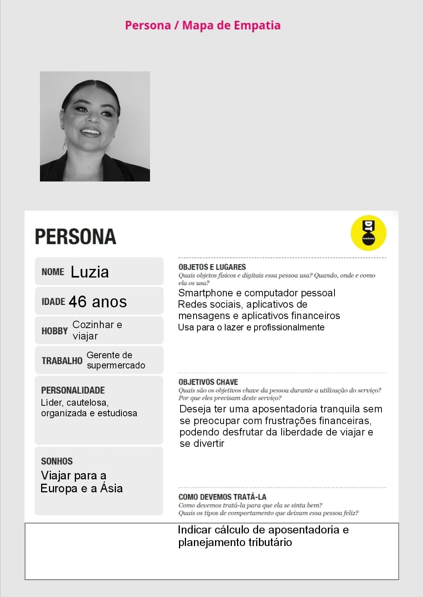

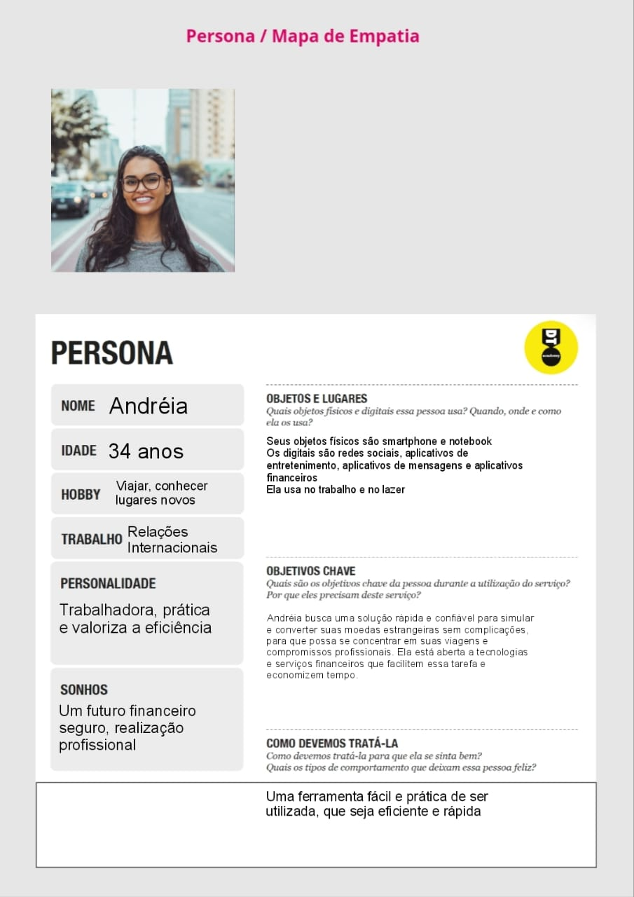

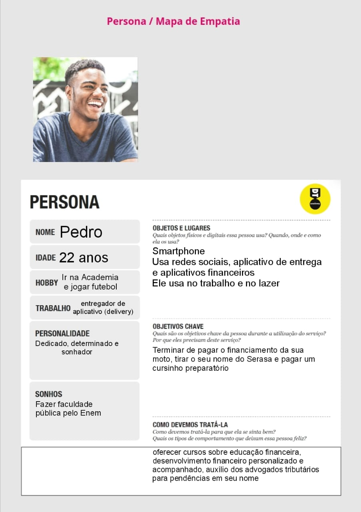
 

## Histórias de Usuários

Com base na análise das personas forma identificadas as seguintes histórias de usuários:

|EU COMO... `PERSONA`| QUERO/PRECISO ... `FUNCIONALIDADE` |PARA ... `MOTIVO/VALOR`                 |
|--------------------|------------------------------------|----------------------------------------|
|Usuário do sistema  | Quero calcular meu imposto de renda anual | Entender melhor minha situação fiscal.|
|Usuário do sistema  | Como usuário internacional, quero converter moedas estrangeiras para minha moeda local | Para realizar transações financeiras com clareza |
|Usuário do sistema  | Como investidor, quero entender como a inflação afeta o valor do meu dinheiro ao longo do tempo.| Para saber o valor do meu dinheiro|
|Usuário do sistema  | Como usuário, quero simular o rendimento de meu título | Para visualizar e ajustar meu investimento |
|Usuário do sistema  | Como entusiasta de mercado financeiro, quero ter acesso a gráficos financeiros atualizados e personalizáveis | Para visualizar o desempenho de ativos financeiros.|
|Usuário do sistema  | Como interessado em melhorar minha educação financeira, quero ter acesso a vídeos e artigos informativos sobre investimentos e planejamento financeiro. | Para aprender sobre educação financeira |

## Requisitos

A tabela que segue apresenta os requisitos funcionais do projeto. 

### Requisitos Funcionais

|ID    | Descrição do Requisito  | Prioridade |
|------|-----------------------------------------|----|
|RF-001| Permitir que o usuário faça o cálculo do tempo necessário para aposentadoria privada | MÉDIA | 
|RF-002| Permitir que o usuário selecione um período de tempo para calcular a inflação acumulada no Brasil nesse período.   | MÉDIA |
|RF-003| Permitir que o usuário faça o cálculo de imposto de renda | MÉDIA |
|RF-004| Permitir que o usuário veja o valor do câmbio de moedas de diferentes países | MÉDIA |
|RF-005| Integrar ferramentas como calculadoras de orçamento ou simuladores de investimento para oferecer aos usuários recursos financeiros úteis. | ALTA |
|RF-006| Permitir que mentores definam horários disponíveis e que mentees agendem sessões, facilitando a comunicação entre mentor e mentee. | MEDIA |
|RF-007| Permitir que o usuario tenha acesso a videos relacionados a educação financeira |  MEDIA |
|RF-008| Integrar ferramenta de analise de gastos e lucros mensais | MEDIA |
|RF-009| Permitir que os usuarios tenham acesso a um time de advogados parceiros para esclarecer e ajudar em questões tributarias | MEDIA |
|RF-010| Dusponibilizar uma area com dúvidas frequentes para auxiliar o usuario | MEDIA |

### Requisitos Não Funcionais

|ID     | Descrição do Requisito  | Prioridade |
|-------|-----------------------------------------|----|
|RNF-001|Interface fácil de usar para uma navegação sem complicações.| ALTA | 
|RNF-002|A plataforma deve ser acessível para pessoas com diferentes habilidades.| ALTA |
|RNF-003|Tempos de carregamento rápidos e respostas ágeis às interações do usuário.| MÉDIA |
|RNF-004|Proteção robusta das informações pessoais e financeiras dos usuários.| ALTA |
|RNF-005|Funcionamento eficaz em uma variedade de dispositivos e sistemas operacionais.| MÉDIA |
|RNF-006|Permitir aos usuários ajustar preferências e receber recomendações personalizadas, não essencial para funcionalidade básica.| BAIXA |
|RNF-007|Adaptar o conteúdo e as práticas financeiras para diferentes idiomas e culturas, importante para alcançar uma base de usuários global.| MÉDIA |
|RNF-008|Implementar um sistema de manutenção eficiente para garantir relevância contínua, prioridade menor durante o estágio inicial.| BAIXA |

# Projeto da Solução

O desenvolvimento do software de Capital Certo utilizou as seguintes tecnologias e frameworks:

HTML: Linguagem base para estruturação do conteúdo das páginas web.

CSS: Linguagem para estilização da interface gráfica do usuário, garantindo um design responsivo e agradável em diferentes dispositivos.

JavaScript: Linguagem para implementar funcionalidades interativas no site, como calculadoras, gráficos e animações, proporcionando uma experiência dinâmica e engajadora para os usuários.

Bootstrap: Framework para desenvolvimento HTML, CSS e JavaScript.

## Wireframes

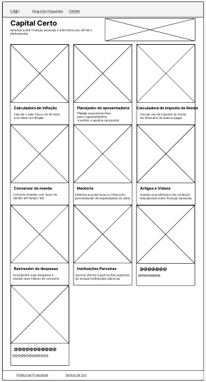
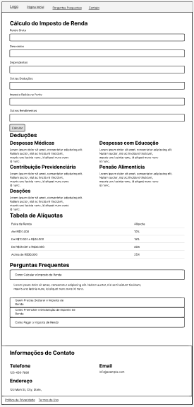
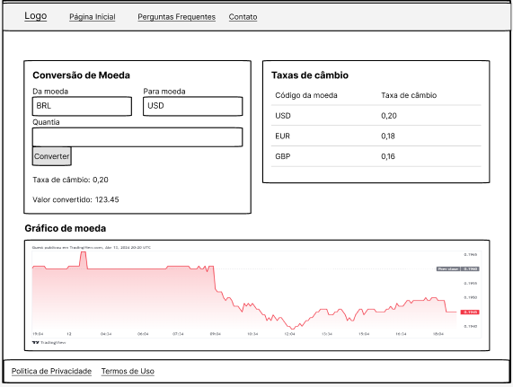
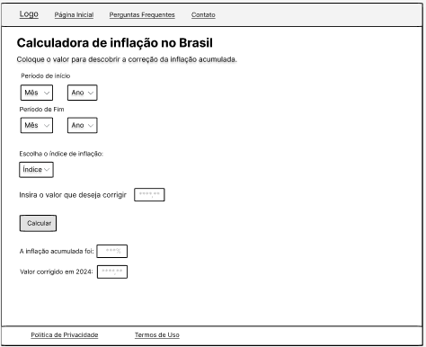
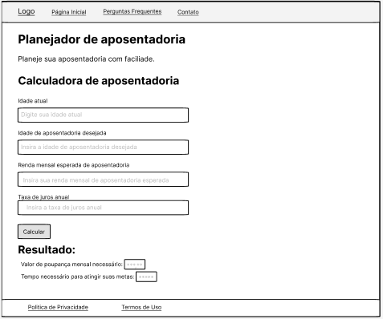
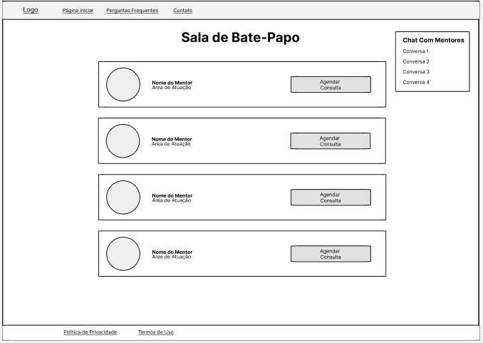
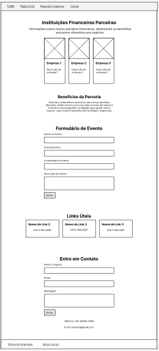
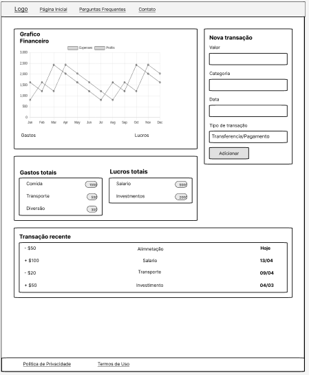
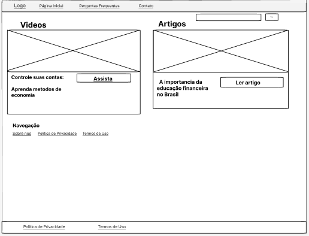
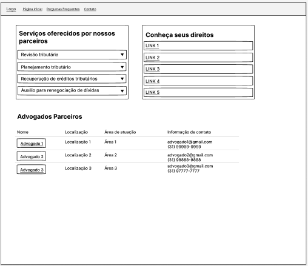
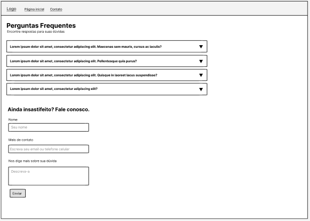

## Mapa de navegação

# Conclusões

......  COLOQUE AQUI O SEU TEXTO ......

> Finalize escrevendo um ou dois parágrafos para relembrar o objetivo do projeto, 
> o que foi possível alcançar e o que ficou para um trabalho futuro, e relembrando
> as principais dificuldes encontradas e como foi possível contorná-las. 

